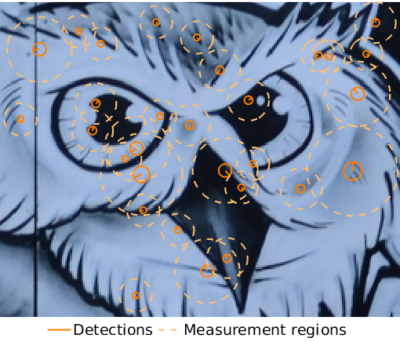

# hpatches: Homography-patches dataset

*HPatches* is a benchmark dataset for feature detectors and consists of image patches extracted from a large set of image sequences either planar or otherwise related by homography. The benchmark definition is part of the [*HBench*](../hbench/README.md) toolbox. For more information, please check the website for the
[Local Features: State of the art, open problems and performance evaluation](http://www.iis.ee.ic.ac.uk/ComputerVision/DescrWorkshop/)
workshop which will take place together with ECCV 2016.

Currently we are releasing only the training subset of *HPatches* for the challenge that will take place as part of the ECCV 2016 workshop. The test set with will be released soon.

To obtain the *HPatches* dataset (training data), download and untar the following file:

`wget www.iis.ee.ic.ac.uk/ComputerVision/DescrWorkshop/hpatches-train.tar.gz`

Sample code for reading the patches in python is provided in the `code` folder. The benchmarking code is distributed as part of the *HBench* toolbox.

For information about relevant citations concerning patches extracted from sequences
that were not originally introduced in this dataset, please check [references.txt](references.txt).

## Dataset Description

Patches are extracted from a number of image sequences, where each sequence contains images of the same scenes. Sequences are organised in folders depending on the type of transformations between images:

* `i_X`: patches extracted from image sequences with illumination changes.
* `v_X`: patches extracted from image sequences with viewpoint changes.

For each image sequence, we provide a set of reference patches `ref.png` extracted from an image used as reference. For all other images in the sequence, we provide two more files, `eX.png` and `hX.png`, containing the "same" (corresponding) patches as found in the other images. In order to simulate the limitations of common patch detectors, correspondence are extracted by adding a certain amount of geometric noise (affine jitter). In particular, the `e` (easy) patches have little geometric noise and the `h` (hard) patches have more. Each patch has a size of `65x65` pixels and a single `*.png` file contains all the patches extracted from an image stacked along a single column.

### Training Set

In training set, patches are ordered by their location. This means that `i`th patch in the file `ref.png` (located at rows `(i-1)*65+1 ... i*65` where the first row has index 1) is in correspondence with the the $i$-th patch in the `eX.png` or `hX.png` files.

## Patch Extraction Method

Each image sequence contains a reference image and 5 target images taken under a different illumination and/or, for a planar scenes, a different viewpoint. For all images we have the estimated ground truth homography $H$ with respect to the reference (stored in CSV files `H_ref_X` where $X=1,...,5$).

*Image 1: Example image sequence. The leftmost image is the reference image, followed by 5 images with a different viewpoint.*

Patches are sampled in the reference image using a combination of local feature extractors (Hessian, Harris and DoG detector). The patch orientation is estimated using a single major orientation using Lowe's method. No affine adaptation is used, therefore all patches are square regions in the reference image.

Patches are extracted from regions with a scale magnified by a factor of 5 compared to the original detected feature scale. Only patches for which this region is fully contained in the image are kept.

In order to prevent multiple detections at the same location, multiple detections with ellipse overlap greater than 50% are clustered and a single ellipse at random is kept. A subset of the detected patches with their measurement regions is shown in the following image:

*Image 2: Example detections in the reference image. Patches locations are visualized as ellipses. The scale of the detected patches (orange) is magnified by factor 5 to obtain the patch measurement region (yellow).*

In order to extract the patches from a target image, first an affine jitter is applied. The goal of the affine jitter is to simulate the geometric repeatability error of typical local features detector.

For easy jitter, the median ellipse overlap with the original patches is ~0.85 and for hard jitter it is ~0.72. After jittering, the frames are reprojected to the target image using the ground truth homography.

The following images show the reprojected easy/hard patches in the target image together with the extracted patches.

*Image 3: Visualization of the easy patches locations in the target images.*

*Image 4: Extracted easy patches from the example sequence.*

*Image 5: Visualization of the hard patches locations in the target images.*

*Image 6: Extracted hard patches from the example sequence.*
